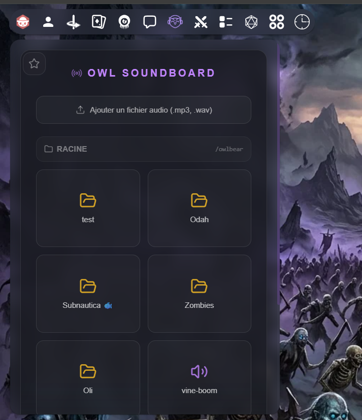

# Owlbear Audio Soundboard - Extension Frontend

## Aperçu de l'interface



## Démo de l'interface

[Tester la démo en direct](https://owl-soundboard-frontend.vercel.app/)

Une extension personnalisée pour Owlbear Rodeo conçue avec **React** et **Vite**. Elle permet aux Maîtres de Jeu (MJ) et aux joueurs de gérer, déclencher et téléverser des pistes audio (`.mp3`, `.wav`) en temps réel directement à l'intérieur de leurs sessions de jeu.

## ✨ Fonctionnalités

* **Synchronisation en direct (Broadcast)** : Lorsqu'un utilisateur clique sur un son, le signal audio est diffusé instantanément à tous les autres participants connectés à la pièce Owlbear Rodeo.
* **Explorateur de fichiers fluide** : Navigation par dossiers et fichiers directement branchée sur un stockage cloud sécurisé.
* **Téléversement direct (Drag & Drop / Sélection)** : Permet d'ajouter de nouveaux effets sonores à la volée durant une partie.
* **Notifications intégrées** : Affiche un retour visuel discret lorsqu'un joueur déclenche une ambiance ou un effet.

## 🛠️ Architecture & Sécurité

Pour respecter les contraintes strictes imposées par Owlbear Rodeo (CORS) et sécuriser la plateforme, l'application est divisée en deux :

1. **Frontend (ce dépôt)** : Gère l'interface utilisateur, le SDK `OBR`, la lecture audio locale et l'encodage des fichiers à téléverser.
2. **Backend proxifié (serveur serverless)** : Reçoit les demandes du frontend pour communiquer de manière sécurisée avec l'API Dropbox sans jamais exposer de clés secrètes aux clients.

---

## ⚙️ Configuration locale

### Prérequis

* Node.js v18+

### Installation

1. Clonez ce dépôt.
2. Placez-vous dans le répertoire du projet.
3. Installez les dépendances :

```bash
npm install
```

### Configuration des variables d'environnement

Créez un fichier `.env.local` à la racine du projet :

```env
VITE_API_URL=https://owl-soundboard-backend.vercel.app/api/dropbox-files
```

Assurez-vous que votre code utilise :

```javascript
import.meta.env.VITE_API_URL
```

pour récupérer cette valeur.

### Lancement du serveur de développement

```bash
npm run dev
```

---

## 🚀 Déploiement et intégration dans Owlbear Rodeo

1. Déployez ce frontend sur votre plateforme d'hébergement préférée (Vercel, Netlify, etc.).
2. Copiez l'URL de production générée.
3. Dans Owlbear Rodeo :

   * Accédez au menu **Extensions**.
   * Ajoutez une extension personnalisée en collant votre URL de production.
   * Ouvrez l'interface à l'intérieur d'une pièce pour initialiser correctement le SDK OBR.

---

## ⚠️ Limitation de l'upload

L'encodage Base64 utilisé pour transférer les fichiers vers les fonctions Serverless ajoute une surcharge d'environ 33 % à la taille des fichiers.

Pour cette raison, les fichiers audio téléversés ne devraient pas dépasser **~3.1 Mo** afin d'éviter les dépassements de limite des plateformes serverless.
