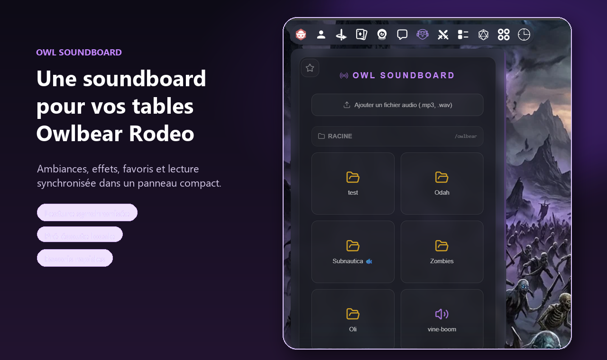
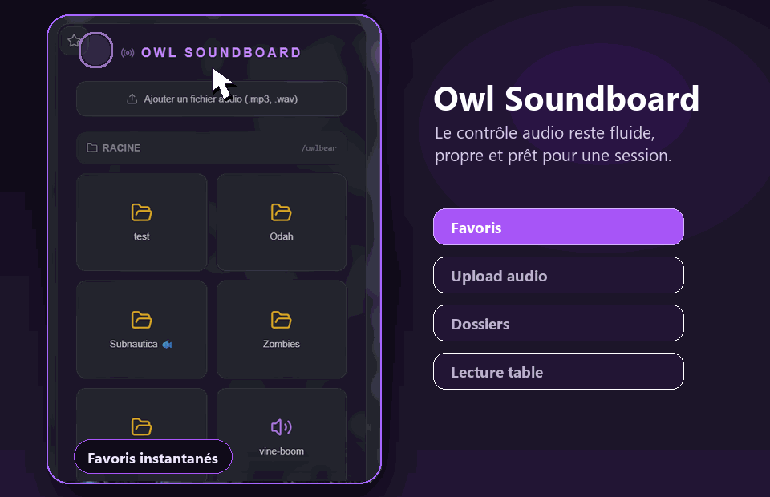
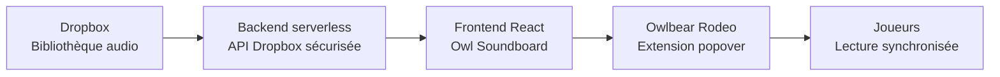

# Owl Soundboard

<p align="center">
  
</p>

<p align="center">
  <strong>Une soundboard moderne pour Owlbear Rodeo, pensée pour déclencher des ambiances et effets sonores en pleine partie.</strong>
</p>

<p align="center">
  <a href="https://owl-soundboard-frontend.vercel.app/">Démo en ligne</a>
  ·
  <a href="https://www.owlbear.rodeo/">Owlbear Rodeo</a>
  ·
  <a href="public/manifest.json">Manifest d'extension</a>
</p>

<p align="center">
  
  
  
  
</p>

## Aperçu

<p align="center">
  
</p>

Owl Soundboard s'intègre directement dans une salle Owlbear Rodeo sous forme de popover compact. Le MJ peut parcourir ses dossiers audio, jouer un son pour la table, pré-écouter une piste localement, marquer ses favoris et arrêter tous les sons actifs depuis une interface sombre et lisible.

## Fonctionnalités

- **Lecture synchronisée dans Owlbear Rodeo** : un son déclenché par un utilisateur est diffusé aux autres participants via le SDK Owlbear.
- **Pré-écoute locale** : l'icône casque permet au MJ de tester un son sans le diffuser à la table.
- **Navigation par dossiers** : la bibliothèque audio conserve la structure Dropbox exposée par le backend.
- **Favoris rapides** : sons et dossiers peuvent être épinglés dans un panneau latéral.
- **Upload intégré** : ajout direct de fichiers `.mp3` et `.wav` depuis l'interface.
- **Contrôle local du volume** : mute, volume et arrêt global des sons actifs.
- **Mode standalone clair** : lorsqu'elle est ouverte hors Owlbear, l'app affiche un rappel d'intégration.

## Démo animée

<p align="center">
  
</p>

## Architecture



Le projet de ce dépôt contient uniquement le **frontend**. Les appels Dropbox passent par un backend proxifié afin d'éviter d'exposer les clés ou tokens Dropbox dans le navigateur.

## Stack

- React 19
- Vite 6
- Tailwind CSS
- Framer Motion
- Lucide React
- `@owlbear-rodeo/sdk`
- Vercel pour l'hébergement statique et les headers du manifest

## Démarrage local

### Prérequis

- Node.js 18 ou plus récent
- Un backend compatible avec l'endpoint Dropbox attendu par l'app

### Installation

```bash
npm install
```

### Lancer l'application

```bash
npm run dev
```

L'application sera disponible sur l'URL locale affichée par Vite, généralement `http://localhost:5173`.

### Build de production

```bash
npm run build
```

### Prévisualiser le build

```bash
npm run preview
```

## Configuration backend

Le frontend pointe actuellement vers :

```txt
https://owl-soundboard-backend.vercel.app/api/dropbox-files
```

L'API doit accepter :

- `GET ?path=/owlbear` pour lister les dossiers et fichiers audio.
- `POST` avec un fichier encodé en Base64 pour téléverser un nouveau son.

Format attendu côté frontend pour la liste :

```json
[
  {
    "name": "Ambiance forêt.mp3",
    "url": "https://...",
    "path": "/owlbear/ambiences/Ambiance forêt.mp3",
    "isFolder": false
  },
  {
    "name": "Combats",
    "path": "/owlbear/combats",
    "isFolder": true
  }
]
```

## Installation dans Owlbear Rodeo

1. Déployer le frontend sur Vercel, Netlify ou un autre hébergeur statique.
2. Vérifier que `public/manifest.json` est accessible publiquement.
3. Dans Owlbear Rodeo, ouvrir la gestion des extensions.
4. Ajouter une extension personnalisée avec l'URL du manifest déployé.
5. Ouvrir l'extension dans une salle pour activer la synchronisation via le SDK Owlbear.

Le fichier `vercel.json` ajoute les headers CORS nécessaires pour que le manifest puisse être lu par Owlbear Rodeo.

## Limites connues

- Les uploads sont limités à environ **3.1 Mo** par fichier, car l'encodage Base64 ajoute du poids avant l'envoi au backend serverless.
- Les formats acceptés par l'interface sont `.mp3`, `.wav` et `.mpeg`.
- Hors Owlbear Rodeo, la lecture reste possible localement, mais la diffusion synchronisée dépend de l'environnement Owlbear.

## Structure

```txt
public/
  manifest.json        Manifest de l'extension Owlbear
  icon.png             Icône affichée dans Owlbear
  iconExtension.png    Icône principale du projet

src/
  App.jsx              Composition de l'interface
  hooks/               Logique de lecture, upload, favoris et SDK Owlbear
  components/          UI de la soundboard
  assets/              Captures utilisées dans le README
```

## Licence

Projet personnel maintenu par Olivier Poirier.
